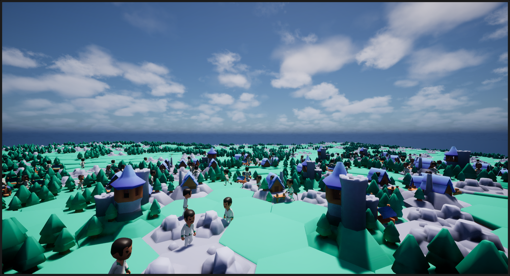

 

  

<h3 align="center">Mass AI Example</h3>

  

    A project primarily used to experiment with Mass, an ECS Framework
     
    <a href="https://github.com/Ji-Rath/MassAIExample"><strong>Explore the docs »</strong></a>
     
     
    <a href="https://github.com/Ji-Rath/MassAIExample#open-simulation-example">View Demo</a>
    &middot;
    <a href="https://github.com/Ji-Rath/MassAIExample/issues/new?labels=bug&template=bug-report---.md">Report Bug</a>
    &middot;
    <a href="https://github.com/Ji-Rath/MassAIExample/issues/new?labels=enhancement&template=feature-request---.md">Request Feature</a>
  

[![Contributors][contributors-shield]][contributors-url]
[![Forks][forks-shield]][forks-url]
[![Stargazers][stars-shield]][stars-url]
[![Issues][issues-shield]][issues-url]
[![project_license][license-shield]][license-url]

# Open Simulation Example
- Gather resources to build a house
- Utilizes smart objects for querying resources in the world
- Uses state tree for AI logic management
- Bridges logic between Mass and game world through subsystems

https://github.com/user-attachments/assets/09a0a425-18ab-4f80-ab91-cb97542eb570

  
Old Videos

https://user-images.githubusercontent.com/1747157/174648031-43e36fd4-816c-42d7-b087-d4fbd3643475.mp4

https://user-images.githubusercontent.com/1747157/172963214-0ef75cdd-75bd-494e-8a21-666cb7a5ba35.mp4

https://user-images.githubusercontent.com/1747157/170729609-3c2716ae-a6a0-40c5-86bf-a437a15e6705.mp4

# Mass Nav Mesh Example
- Entities utilize nav mesh to find optimal path to location
- Use async functionality to reduce overhead
- Uses State Tree

# Mass Persistence Example
- Simple example outlining one approach to a save/load system
- Signal processor to write data
- Subsystem for centralized processing
- Uses current Unreal Save System

# Mass Smart Object Example
- Uses smart objects and state tree for mass entity interaction
- Claims then uses object, plays an example effect

# Mass Wander AI
- Barebones example which uses a custom state tree task to find a random location, then command the entity to move there

# Spatial Hash Grid Example
- Example for utilizing a spatial hash grid for fast queries in the world. The same underlying system is used for mass avoidance.
- Allows the user to query an area and returns entities that are within the range.
- Custom processor for updating entities location within the hash grid

# State Tree Example
- Simple example which outlines basic state tree logic (using mass).
- Utilizes tasks and nodes within the tree for organizing logic

# Vertex Anim Character Example
- Showcases the Vertex Animation Plugin converting skeletal mesh animations to vertex animation.
- Barebones and mainly used in the Open Simulation example

# Bullet Hell Example
- Experiment with efficient entities and bullet spawning
- Simple manager which respawns entities
- Basic top down movement and click to shoot

# Research
These are my rough notes outlining discoveries made within mass and the city sample. Please don't expect anything well formatted, some things may even be outdated.
### Mass Visualization
- Visualization Trait
- Mass Viewer Info Fragment
- Mass Actor Fragment (For actor visualization)
- Mass Visualization LOD Processor (Index 41)
- LODCollectorProcessor is disabled by default for some reason, which is needed when
entity counts are high

### Mass LOD
- Mass LOD Collector Trait
- Mass LOD Collector Processor (Index 17)

### Agent Radius
- Using Assorted Fragments and Agent Radius Fragment will allow you
to override the default radius of agents for the entity

### Movement Trait
- The height is simply interpolated based on the target location
and current height. It should not be relied on to give completely
accurate results when the distance is far. A possible solution
would be to update the target location z during movement.

### General Mass Information
- Fragments hold data (FMassFragment)
- Filter entities using tags (FMassTag)
- Traits contain fragments/tags (UMassEntityTraitBase)
- Processors use fragment data to perform tasks on entities (UMassProcessor)
- StateTree and Fragments are sortof like BehaviorTree and Blackboard
- ObserverProcessors can observe more than one fragment/tag by overriding the
Register() function.

### State Tree Information
- Evaluators basically gather data to be used in the state tree
- Enter Conditions are used on leaf nodes to see whether a leaf should be executed
- Tasks from ST are like BT, execute logic
- Transitions allow the state tree to go to other branches based on a condition
- Reference: https://docs.unrealengine.com/5.0/en-US/overview-of-state-tree-in-unreal-engine/
- Category for UPROPERTY in InstanceData determines what kind of value it is (Input, Output, Parameter)
- State Tree will throw an ensure when there are fragments missing for a task to execute.
The only way I know to debug which fragments are missing is to goto the task and look
for TStateTreeExternalDataHandle in the header file.

 <b> State Tree Experimental Findings </b> 

<ul>
<li>
Tick on StateTree Tasks are only ran once and with subscribed signals
(see UMassStateTreeProcessor)
</li>
<li>
I found no feasable way to subscribe signals in MassStateTreeProcessor.
As a hacky solution just reuse one of the hardcoded signals
</li>
<li>
A <b>SmartObjectDefinition</b> needs <b>USmartObjectMassBehaviorDefinition</b>
and ALL default tag filters to show on <b>Mass SmartObject Eval</b> evaluator.
</li>
<li>
<b>UseSmartObjectTask</b> will only execute
<b>USmartObjectMassBehaviorDefinition</b>, meaning only C++ logic for the time
</li>
<li>
Destroying a smart object safely in <b>USmartObjectMassBehaviorDefinition</b>
should be done using PushCommand(). Lets the <b>SmartObjectUseTask</b> release the
smart object before destruction. (may be source of ensures being fired, need
to investigate further)
</li>
<li>
Empty states with transitions seem to produce unexpected behavior. The state tree
also always needs to be in an active state, even if idle.
</li>
<li>
SmartObjectUseTask modifies MassMoveTarget around line 163-164, caused a headache
since entities would not move after using a smart object.
</li>
</ul>

### Smart Objects
- FMassSmartObjectHandler should be used rather than directly getting the smart
object subsystem in mass....i think (seems to be used in~~~~ state tree tasks).
### Instanced Static Meshes and Visualization
- Its possible to apply unique textures to each instance through an atlas and getting
a random num to choose the frame - dont forget to use
[Vertex Interpolator and use a small float to fix precision issues](https://unrealcommunity.wiki/using-per-instance-custom-data-on-instanced-static-mesh-bpiygo0s).
- Vertex animation can be achieved by a similar tactic of using instance custom data
to determine which animation to play
- To setup vertex animation, I used [Vertex_Anim_Toolset](https://github.com/BenVlodgi/Vertex_Anim_Toolset) and a UE5 fork
- In the processor, order is important when giving instance custom floats.
**FMassRepresentationFragment**, **FMassRepresentationLODFragment**, and **RepresentationSubsystem**
should be all you need to get started with instance custom data.
(See URTSAnimationProcessor)

### City Sample and AnimToTexture Plugin
#### This is in regards to how ISM processors get anim data and update custom data
- Processors get their data from MassRepresentationSubsystem. At some point,
actor templates are added via **FindOrAddTemplateActor()**. (Update: This is done for us most likely
somewhere in the visualization/representation processors if you have actor visualization)
- The CDO is then retrieved via **GetDefaultObject()** and data can be retrieved. 
In this case, it is a **CrowdCharacterDataAsset**.
- A **FCrowdCharacterDefinition** is generated based on the data asset which contains
the key info for animation among other things. (its a little more complex than described
since the data is really retrieved from the **FCrowdCharacterDefinition**, just selected
based on the human's properties)
- Finally, the animation data (**UAnimToTextureDataAsset**) is saved to the entities **FCrowdAnimationFragment** for
future use in processors
- Note: Data assets appear to be added to the character BP (high actor visualization), this is why the data can be accessed.
- The actor can be retrieved using **FMassRepresentationFragment.HighResTemplateActorIndex** and **RepresentationSubsystem->GetTemplateActorClass**
- To be honest, a simple SharedFragment is probably sufficient for simple use-cases.
I definitely might change my mind when I attempt to sync actor/ISM animation
- Actual anim state index is updated in **UMassProcessor_Animation** and custom data is updated at
**UMassCrowdUpdateISMVertexAnimationProcessor::UpdateISMVertexAnimation** in various processors

### HashGrids
- TPointHashGrid3 performance is considerably worse compared to THierarchicalHashGrid2D
- This could be caused by the extra dimension, testing scenario, or more efficient logic for mass (as THierarchicalHashGrid2D is used in MassAvoidance)
- Worst case scenario for similar search query: 235.9μs -> 8μs (x30 performance boost!)
### TODO
- Find a way to use Mass SmartObject Eval effectively in the State Tree (DONE)
- Convert logic in RTSMovementProcessor to State Tree (KINDOF DONE)
- Agent gets stuck after using one smart object, find out why (DONE)
- The UseSmartObject task also messes with the MoveTargetFragment. It seems to
be doing some stuff in ActivateActionAnimate() at MassZoneGraphNavigationUtils too.
  (DONE)

[contributors-shield]: https://img.shields.io/github/contributors/Ji-Rath/MassAIExample.svg?style=for-the-badge
[contributors-url]: https://github.com/Ji-Rath/MassAIExample/graphs/contributors
[forks-shield]: https://img.shields.io/github/forks/Ji-Rath/MassAIExample.svg?style=for-the-badge
[forks-url]: https://github.com/Ji-Rath/MassAIExample/network/members
[stars-shield]: https://img.shields.io/github/stars/Ji-Rath/MassAIExample.svg?style=for-the-badge
[stars-url]: https://github.com/Ji-Rath/MassAIExample/stargazers
[issues-shield]: https://img.shields.io/github/issues/Ji-Rath/MassAIExample.svg?style=for-the-badge
[issues-url]: https://github.com/Ji-Rath/MassAIExample/issues
[license-shield]: https://img.shields.io/github/license/Ji-Rath/MassAIExample.svg?style=for-the-badge
[license-url]: https://github.com/Ji-Rath/MassAIExample/blob/master/LICENSE.txt
